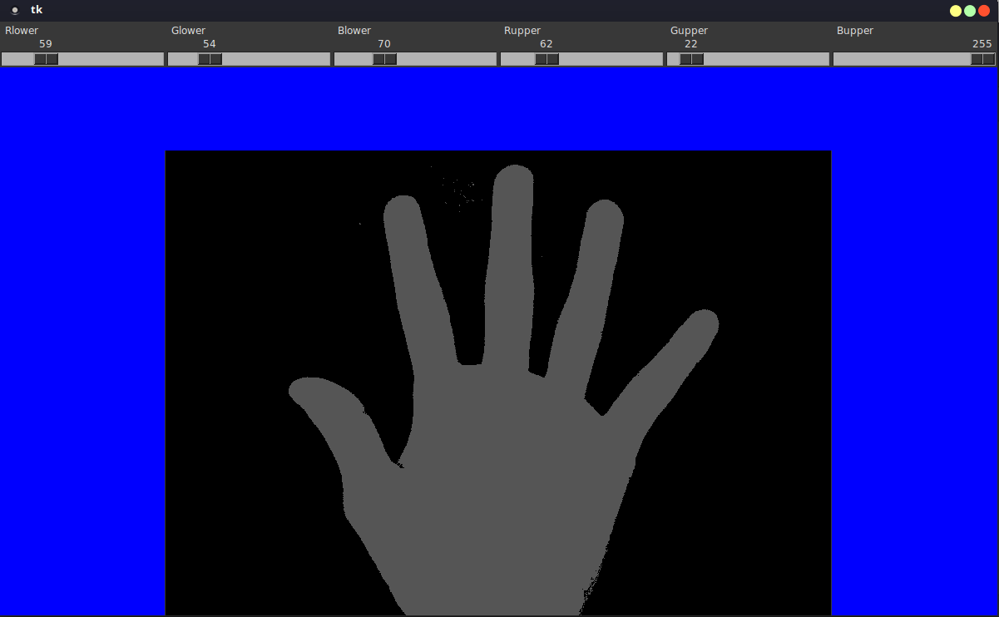

# dynamic-thresholding

- This module lets you apply arguments to a function dynamically and shows change in image at runtime.
- <code>binary.py</code> is containing the algorithm of binary filtering and using the slider we can set the lower and upper values and pixels falling within range will be shown in image.
- Run using <code> python dynamic_thresholding.py hand.jpg </code>
- Enter <code>gray</code> or <code>R G B</code>at next prompt to create multiple sliders.
